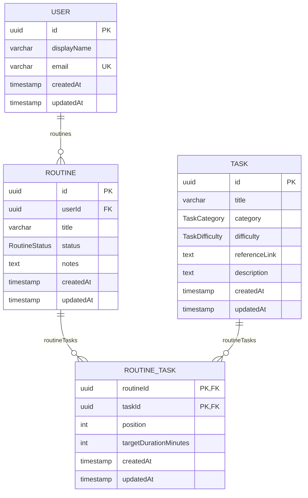

# Guitar Coach API

Backend for Guitar Coach, built with [NestJS](https://nestjs.com/) as a **Nest CLI monorepo** with two independently-deployable applications under `apps/`:

- **`apps/guitar-coach`** — the main HTTP API (this is what "the API" means everywhere below unless noted otherwise).
- **`apps/activity-feed-service`** — a pure NestJS microservice (no HTTP server) that consumes activity events off RabbitMQ and persists them to MongoDB (see [Activity feed](#activity-feed)).

There's no shared `libs/` directory — the two apps don't share code; each owns its own copy of any cross-app contract it depends on (e.g. the `routine.created` event shape).

## Overview

`apps/guitar-coach` is a standard NestJS application (Express platform) organized by feature module:

- **`config`** — loads and validates environment variables at startup using [Zod](https://zod.dev/) (`config/env.validation.ts`), exposed globally via `AppConfigModule`.
- **`health`** — Kubernetes/Docker-style liveness and readiness probes via [`@nestjs/terminus`](https://docs.nestjs.com/recipes/terminus).
- **`auth`** — email/password authentication via [Better Auth](https://www.better-auth.com/), mounted through [`@thallesp/nestjs-better-auth`](https://github.com/ThallesP/nestjs-better-auth) (see [Authentication](#authentication)).
- **`users`** — CRUD user management backed by Postgres via Prisma (see [Architecture decisions](#architecture-decisions)).
- **`tasks`** — CRUD task-library management backed by Postgres via Prisma, with pagination and filtering by `category`/`difficulty` (see [Data model](#data-model)), and Redis-cached `GET` responses.
- **`routines`** — CRUD routine management backed by Postgres via Prisma; publishes a `routine.created` event to RabbitMQ on creation (see [Activity feed](#activity-feed)).
- **`activity-feed`** — exposes `GET /api/v1/activity-feed`, proxying to `activity-feed-service` over RabbitMQ (see [Activity feed](#activity-feed)).
- **`prisma`** — `PrismaService`/`PrismaModule` wiring Prisma ORM to Postgres (see [Architecture decisions](#architecture-decisions)).
- **`redis`** — `RedisLockModule`/`RedisLockService`, a distributed lock used to serialize concurrent routine-task reorders.

API docs are served by Swagger UI at `/docs` once the app is running (main API only — `activity-feed-service` has no HTTP surface, so nothing to document there).

## Data model

Defined in `prisma/schema.prisma`; regenerate the diagram below by hand if the schema changes.



`category`, `difficulty`, and `status` are Postgres enums, not free-form strings:

- `TaskCategory`: `technique` | `theory` | `repertoire`
- `TaskDifficulty`: `easy` | `medium` | `hard`
- `RoutineStatus`: `active` | `archived` (default `active`)

`RoutineTask` is a join table between `Routine` and `Task` with a composite primary key (`routineId`, `taskId`) and a unique `(routineId, position)` constraint enforcing one task per position within a routine.

## Local setup

### Prerequisites

- Node.js 24.x and npm
- Docker (for Postgres/Redis/RabbitMQ/MongoDB, and optionally for running the apps themselves)

### Option A — Docker Compose (recommended)

Runs everything together — both apps plus all four infra services (Postgres, Redis, RabbitMQ, MongoDB).

```bash
cp .env.example .env   # fill in POSTGRES_PASSWORD, RABBITMQ_PASSWORD, MONGO_INITDB_ROOT_PASSWORD at minimum
docker compose -f compose.yaml -f compose.dev.yaml up --watch
```

**The `--watch` flag matters** — there are no bind-mount volumes here, only Compose's [`develop.watch`](https://docs.docker.com/compose/how-tos/file-watch/) config, which is inert unless you pass `--watch` on `up` (or run `docker compose watch` in a separate terminal alongside a plain `up`). Without it, the containers still start fine, but editing source afterward does nothing until you rebuild/restart manually.

This starts six containers:

| Service | What it is | Reachable at |
|---|---|---|
| `api` | main API (`apps/guitar-coach`) | `http://localhost:3000` (or `$PORT`) |
| `activity-feed-service` | activity feed microservice (`apps/activity-feed-service`) | no HTTP port — RabbitMQ-only, check `docker compose logs activity-feed-service` |
| `postgres` | Postgres 17 | `localhost:$POSTGRES_PORT` (default `5432`) |
| `redis` | Redis 8 | `localhost:$REDIS_PORT` (default `6379`) |
| `rabbitmq` | RabbitMQ 4 (with management UI) | AMQP on `localhost:$RABBITMQ_PORT` (default `5672`); UI at `http://localhost:$RABBITMQ_MANAGEMENT_PORT` (default `15672`), login with `RABBITMQ_USER`/`RABBITMQ_PASSWORD` |
| `mongodb` | MongoDB 8 | `localhost:$MONGODB_PORT` (default `27017`) |

Both `api` and `activity-feed-service` reload on changes under their respective `apps/<name>/src` (and `api` also under `apps/guitar-coach/test`) — see the `develop.watch` blocks in `compose.dev.yaml`. Editing a file shared by both (`package.json`, `nest-cli.json`, `tsconfig*.json`) triggers a full image rebuild for both, since they share one Dockerfile/image.

To run only a subset (e.g. just the infra, if you're running an app via [Option B](#option-b--node-directly) instead):

```bash
docker compose -f compose.yaml -f compose.dev.yaml up postgres redis rabbitmq mongodb
```

**After changing `prisma/schema.prisma`**, rebuild the `api` image before testing against it (this does **not** affect `activity-feed-service`, which has no Prisma dependency):

```bash
docker compose -f compose.yaml -f compose.dev.yaml build api
docker compose -f compose.yaml -f compose.dev.yaml up -d api
```

The container's startup command only runs `prisma migrate deploy` (applies migration SQL) — it never runs `prisma generate`, so a running container's Prisma Client is stuck with whatever shape the schema had at image build time. Source file sync doesn't cover this either. Symptoms if you skip this: `PrismaClientValidationError: Unknown argument '<field>'` in `docker compose logs api`, or a DB value you just changed (e.g. a user's `role`) not seeming to take effect.

For a production-shaped build instead (both apps share one Dockerfile/image — `dockerfile`'s `build` stage compiles both, so a `docker compose build` here builds both regardless of which service you list):

```bash
docker compose -f compose.yaml -f compose.prod.yaml up --build
```

### Option B — Node directly

Run the main API without Docker (you'll still need the infra containers, or equivalents reachable at the URLs below):

```bash
npm install
cp .env.example .env   # PORT/API_PREFIX/API_VERSION have defaults; NODE_ENV and DATABASE_URL are required
npx prisma generate     # generates the Prisma Client into apps/guitar-coach/src/generated/prisma
docker compose -f compose.yaml -f compose.dev.yaml up postgres redis rabbitmq   # activity-feed-service's queue needs a live broker even to boot the API
npx prisma migrate deploy
npm run start:dev
```

Note: `PrismaService` connects lazily, so the API boots without a reachable Postgres — but most endpoints query the database on every request, so you'll need one running (and migrated) before calling them. `RoutinesService` also connects to Redis (routine-task reorder locking) and RabbitMQ (publishing `routine.created`) at boot — the API won't start at all without a reachable RabbitMQ, since the `ClientsModule` connection is established eagerly.

**To also run `activity-feed-service`** (needed if you want `GET /api/v1/activity-feed` to actually return data, rather than time out waiting for a reply), in a second terminal:

```bash
docker compose -f compose.yaml -f compose.dev.yaml up mongodb   # if not already running
npm run start:dev:activity-feed-service
```

No `prisma generate`/migration step needed for this app — its Mongo schema is applied automatically by Mongoose on first write, no separate migration tooling.

### Environment variables

Validated in each app's own `config/env.validation.ts`; every app fails fast on startup if its required variables are missing or malformed. `apps/guitar-coach` and `apps/activity-feed-service` share the same RabbitMQ broker but otherwise have disjoint requirements — the table below is the union across both.

| Variable | Required by | Default | Notes |
|---|---|---|---|
| `NODE_ENV` | both apps | — | `development` \| `test` \| `production` |
| `PORT` | main API | `3000` | |
| `API_PREFIX` | main API | `api` | Global route prefix |
| `API_VERSION` | main API | `v1` | |
| `POSTGRES_USER` / `POSTGRES_PASSWORD` / `POSTGRES_DB` / `POSTGRES_PORT` | Compose only | — | Configure the `postgres` container in `compose.yaml` |
| `DATABASE_URL` | main API | — | Postgres connection string read by Prisma (CLI and `PrismaService`). `compose.yaml` overrides it to point at the `postgres` service; `.env.example` has a `localhost` default for running the API outside Docker |
| `BETTER_AUTH_SECRET` | main API | — | Encryption/signing secret for Better Auth, min 32 characters. Generate with `openssl rand -base64 32`; never reuse the placeholder in `.env.example` |
| `BETTER_AUTH_URL` | main API | — | Base URL the API is served from (e.g. `http://localhost:3000`). Better Auth appends its own `/auth` base path |
| `REDIS_URL` | main API | — | Redis connection string, used for response caching and the routine-task reorder lock. `compose.yaml` overrides it to the `redis` service |
| `CACHE_TTL_MS` | main API | `300000` | TTL for cached `GET /tasks`/`GET /tasks/:id` responses, in ms (60000–600000) |
| `RABBITMQ_USER` / `RABBITMQ_PASSWORD` / `RABBITMQ_PORT` / `RABBITMQ_MANAGEMENT_PORT` | Compose only | — | Configure the `rabbitmq` container in `compose.yaml` |
| `RABBITMQ_URL` | both apps | — | AMQP connection string. Main API uses it to publish `routine.created` and to send `activity-feed.get-by-user` queries; `activity-feed-service` uses it to consume both. `compose.yaml` overrides it to the `rabbitmq` service for both containers |
| `MONGO_INITDB_ROOT_USERNAME` / `MONGO_INITDB_ROOT_PASSWORD` / `MONGODB_PORT` | Compose only | — | Configure the `mongodb` container in `compose.yaml` |
| `MONGODB_URL` | `activity-feed-service` only | — | MongoDB connection string, used to persist activity feed entries. `compose.yaml` overrides it to the `mongodb` service |

See `.env.example` for the full annotated list.

### Common commands

```bash
# apps/guitar-coach (main API) — the default project, no name needed
npm run start:dev      # watch mode
npm run build           # compile to dist/apps/guitar-coach
npm run start:prod      # run compiled output

# apps/activity-feed-service — explicit project name required
npm run start:dev:activity-feed-service
npm run build:activity-feed-service       # compile to dist/apps/activity-feed-service
npm run start:prod:activity-feed-service

npm run lint             # eslint --fix, both apps
npm run test             # unit tests (*.spec.ts, both apps)
npm run test:e2e         # e2e tests — main API only; activity-feed-service has no e2e harness
npm run test:cov         # coverage

npx prisma generate      # regenerate Prisma Client into apps/guitar-coach/src/generated/prisma after a schema change
npx prisma migrate dev   # create/apply a migration against DATABASE_URL
npx prisma studio        # browse the database
```

A Husky `pre-commit` hook checks `package-lock.json` stays in sync whenever `package.json` is staged.

## Authentication

Auth is handled by [Better Auth](https://www.better-auth.com/) (email/password only for now), mounted at the bare `/auth` path — **not** under the `${API_PREFIX}/${API_VERSION}` prefix used by every other route, and not documented in the `/docs` Swagger UI (Better Auth's endpoints are raw Express middleware, not Nest controllers, so Swagger can't introspect them).

A global `AuthGuard` protects every other route by default — requests without a valid session cookie get `401 Unauthorized`. Individual routes opt out with the `@AllowAnonymous()`/`@OptionalAuth()` decorators from `@thallesp/nestjs-better-auth`.

```bash
# Sign up (creates the User row + a session cookie)
curl -i -c cookies.txt -X POST http://localhost:3000/auth/sign-up/email \
  -H 'Content-Type: application/json' \
  -d '{"email":"jordan@example.com","password":"correct-horse-battery","name":"Jordan"}'

# Sign in (existing user)
curl -i -c cookies.txt -X POST http://localhost:3000/auth/sign-in/email \
  -H 'Content-Type: application/json' \
  -d '{"email":"jordan@example.com","password":"correct-horse-battery"}'

# Inspect the current session
curl -i -b cookies.txt http://localhost:3000/auth/get-session

# Sign out (revokes the session)
curl -i -b cookies.txt -X POST http://localhost:3000/auth/sign-out

# Call a protected route with the session cookie
curl -i -b cookies.txt http://localhost:3000/api/v1/users/me
```

`sendVerificationEmail`/`sendResetPassword` (`apps/guitar-coach/src/auth/email.ts`) currently just `console.log` the link instead of sending a real email — check the server output for the verification link after signing up.

### Roles & admin access

Two roles: `user` (default for every new sign-up) and `admin`, enforced via the `@Roles(['admin'])` decorator from `@thallesp/nestjs-better-auth` on `UsersController`'s and `TasksController`'s mutating/listing routes. Backed by Better Auth's `admin` plugin (`apps/guitar-coach/src/auth/auth.ts`).

`role` is a server-only field — it is **not** accepted in the `/auth/sign-up/email` body (or any other client-facing endpoint). Every new user gets `role: "user"` regardless of what you send.

**Bootstrapping the first admin**: Better Auth's admin endpoints (`/auth/admin/set-role`, `/auth/admin/create-user`) always require an authenticated admin session when called over real HTTP — there's no way to promote the very first user through the API. Set it directly in the database once:

```bash
npx prisma studio   # opens http://localhost:5555
```

Open the `User` table and change that row's `role` to `admin`. (If you're on Docker Compose, remember the container's Prisma Client needs rebuilding after any schema change — see [Option A above](#option-a--docker-compose) — though editing existing data via Prisma Studio doesn't require that.)

**Promoting/demoting a user once an admin exists** — reuse the cookie-jar pattern from above:

```bash
# Sign in as the admin
curl -i -c cookies.txt -X POST http://localhost:3000/auth/sign-in/email \
  -H 'Content-Type: application/json' \
  -d '{"email":"admin@example.com","password":"correct-horse-battery"}'

# Promote another user to admin (or back to "user")
curl -i -b cookies.txt -X POST http://localhost:3000/auth/admin/set-role \
  -H 'Content-Type: application/json' \
  -d '{"userId":"<target-user-uuid>","role":"admin"}'
```

## Activity feed

```
Client
  ↓ HTTP
Main API (apps/guitar-coach)
  ├── POST /api/v1/routines          — creates the routine, then emits routine.created
  ├── GET  /api/v1/activity-feed     — sends activity-feed.get-by-user, waits for the reply
  │
  │            ↓ emit(routine.created) / send(activity-feed.get-by-user)
  │         RabbitMQ — single durable queue: activity_feed_queue
  │            ↓
  │   ActivityFeedService (apps/activity-feed-service)
  │            ↓
  │         MongoDB — activity_feed_entries collection
  │
  └── GET /api/v1/activity-feed returns whatever the RPC reply contained
```

- `RoutinesService.create()` publishes `routine.created` via `ClientProxy.emit()` (fire-and-forget — a broker outage doesn't fail the HTTP request) after the Postgres write succeeds.
- `ActivityFeedService` is a pure microservice (`NestFactory.createMicroservice()`, no HTTP server) listening on one RabbitMQ queue, `activity_feed_queue`, which carries both `@EventPattern('routine.created')` (persists a Mongo document, deduplicated by a unique index on `eventId` in case RabbitMQ redelivers) and `@MessagePattern('activity-feed.get-by-user')` (returns up to 50 of that user's most recent entries, newest first).
- `GET /api/v1/activity-feed` derives `userId` **only** from the authenticated session (`@Session() session: UserSession`) — it takes no query parameters, so a request can't read another user's feed by passing `?userId=...`.
- There's no pagination on the feed endpoint (fixed 50-entry cap) and no automated e2e test for the live RabbitMQ↔MongoDB round trip — verify that path manually via [Option A](#option-a--docker-compose): create a routine, then check `docker compose logs activity-feed-service` and `GET /api/v1/activity-feed`.

For a full step-by-step walkthrough of every request flow in the app — auth, users, tasks, routines, the reorder lock, and this activity feed — including failure modes for Redis/RabbitMQ/MongoDB outages, see [`docs/flows.md`](docs/flows.md).

## Architecture decisions

- **Nest CLI monorepo, not a shared lib.** `apps/guitar-coach` and `apps/activity-feed-service` are two Nest "projects" in one `nest-cli.json`, sharing one `package.json`/`node_modules`/Dockerfile/lockfile, but with no `libs/` between them — `activity-feed-service` keeps its own copy of the `routine.created` event contract rather than importing across `apps/`. Chosen for the isolation of a genuinely separate deployable (matches the spec calling it a standalone microservice) without the overhead of a second `package.json`/lockfile to keep in sync.
- **One Dockerfile, one image, for both apps.** The `build` stage compiles both projects (`nest build` + `nest build activity-feed-service`) into the same `dist/`, and the final image contains both — `compose.yaml` picks which app a given container runs via `command:`, not via separate images. Keeps the "prove `npm ci` works on Alpine" verification (see below) a single check instead of two.
- **Config validation with Zod, not `class-validator`.** Environment variables are parsed once at boot through a Zod schema (`env.validation.ts`) rather than Nest's usual `class-validator`-based config approach, so invalid/missing env vars crash startup immediately with a clear message instead of surfacing as runtime errors deep in a request.
- **Global API prefix + versioning, health checks excluded.** `main.ts` sets a global prefix of `${API_PREFIX}/${API_VERSION}` (e.g. `/api/v1`) but explicitly excludes `health/live` and `health/ready` so container orchestrators can probe unversioned, well-known paths.
- **Liveness vs. readiness split.** `health/live` reports process-up-ness only (no checks). `health/ready` additionally checks heap/RSS memory and disk usage via Terminus, matching the Docker/Compose `HEALTHCHECK` which polls `/health/ready`.
- **`users` module backed by Prisma.** The `users` module (controller/service/DTOs) is a complete vertical slice against Postgres, with `UsersService` injecting `PrismaService` directly — matching NestJS's own [Prisma recipe](https://docs.nestjs.com/recipes/prisma), which doesn't interpose a separate repository class. `UsersService` owns business rules and translates Prisma errors (`P2002` unique violation, `P2025` not found) into `ConflictException`/`NotFoundException`. Uniqueness is enforced by the database's unique index on `email` and caught after the write, rather than checked beforehand, to avoid a check-then-act race between concurrent requests.
- **Prisma ORM wired to Postgres.** `PrismaModule`/`PrismaService` (`apps/guitar-coach/src/prisma/`) wire Prisma Client into Nest as a global provider, using the `@prisma/adapter-pg` driver adapter over `pg` per Prisma 7's required driver-adapter workflow. `PrismaService` doesn't eagerly connect in `onModuleInit` — Prisma Client connects lazily on first query, so the app can boot without a reachable Postgres until a module actually queries the database. The generated client is emitted to `apps/guitar-coach/src/generated/prisma` (gitignored, regenerate with `prisma generate`) with `moduleFormat = "cjs"`, since this project is CommonJS and the default ESM output breaks under `ts-jest`. See [Data model](#data-model) for the full schema. `activity-feed-service` has no Prisma dependency — it's Mongoose/MongoDB only.
- **Multi-stage Dockerfile, dev vs. prod targets.** The Dockerfile separates a `development` target (full `node_modules`, `start:dev`, source bind-mounted via Compose `watch`) from a `production` target (prod-only dependencies, compiled `dist/` only, runs as the non-root `node` user). `compose.dev.yaml` / `compose.prod.yaml` are overlays selecting the target rather than separate Dockerfiles, keeping build logic in one place; both `api` and `activity-feed-service` build from these same targets.
- **Global validation pipe with `whitelist` + `forbidNonWhitelisted`.** Incoming request bodies are stripped of unknown properties and reject requests containing them, so DTOs (e.g. `CreateUserDto`) are the sole contract for what the API accepts.
- **Swagger mounted unauthenticated at `/docs`.** Unaffected by the global `AuthGuard` (Swagger, like Better Auth's own routes, is mounted directly on the underlying HTTP adapter rather than as a Nest controller). Acceptable for now since it only exposes route/DTO shapes, not data; revisit (gate behind auth, or disable in production) once that's no longer true.
- **Auth endpoints documented in the README, not Swagger.** `@nestjs/swagger` only introspects Nest controllers; Better Auth's endpoints are raw Express middleware, so they don't appear in the generated OpenAPI document. See [Authentication](#authentication) for example requests instead.

## Resources

- [docs/flows.md](docs/flows.md) — step-by-step walkthrough of every request flow and failure mode
- [NestJS Documentation](https://docs.nestjs.com)
- [NestJS Microservices (RabbitMQ)](https://docs.nestjs.com/microservices/rabbitmq)
- [NestJS Monorepo mode](https://docs.nestjs.com/cli/monorepo)
- [Terminus health checks](https://docs.nestjs.com/recipes/terminus)
- [Zod](https://zod.dev/)
- [Better Auth](https://www.better-auth.com/docs)
- [Mongoose](https://mongoosejs.com/docs/)
