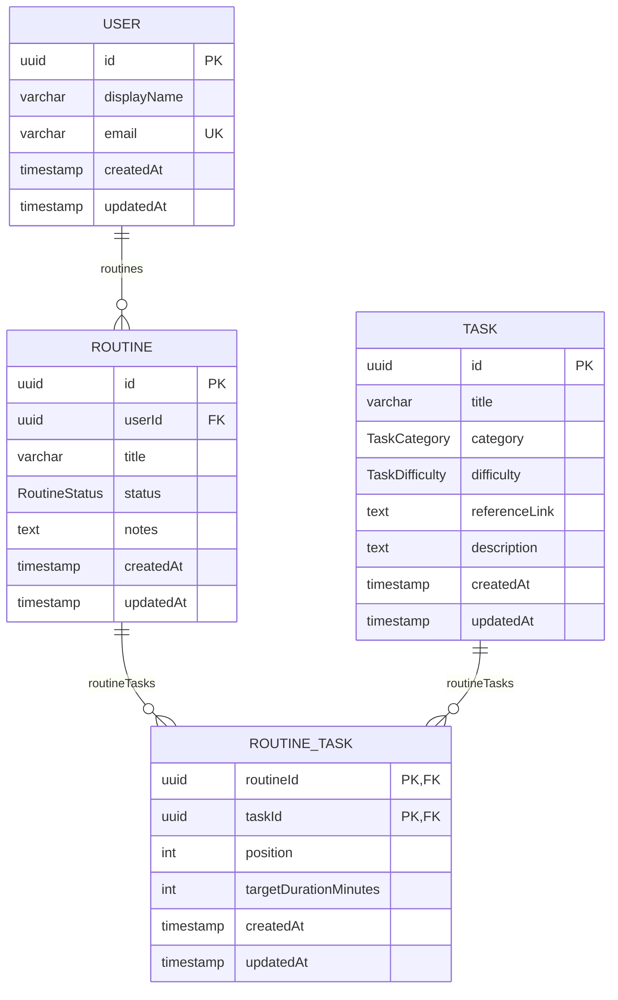

# Guitar Coach API

Backend API for Guitar Coach, built with [NestJS](https://nestjs.com/).

## Overview

The project is a standard NestJS application (Express platform) organized by feature module:

- **`config`** — loads and validates environment variables at startup using [Zod](https://zod.dev/) (`src/config/env.validation.ts`), exposed globally via `AppConfigModule`.
- **`health`** — Kubernetes/Docker-style liveness and readiness probes via [`@nestjs/terminus`](https://docs.nestjs.com/recipes/terminus).
- **`users`** — CRUD user management backed by Postgres via Prisma (see [Architecture decisions](#architecture-decisions)).
- **`tasks`** — CRUD task-library management backed by Postgres via Prisma, with pagination and filtering by `category`/`difficulty` (see [Data model](#data-model)).
- **`prisma`** — `PrismaService`/`PrismaModule` wiring Prisma ORM to Postgres (see [Architecture decisions](#architecture-decisions)).

API docs are served by Swagger UI at `/docs` once the app is running.

## Data model

Defined in `prisma/schema.prisma`; regenerate the diagram below by hand if the schema changes.



`category`, `difficulty`, and `status` are Postgres enums, not free-form strings:

- `TaskCategory`: `technique` | `theory` | `repertoire`
- `TaskDifficulty`: `easy` | `medium` | `hard`
- `RoutineStatus`: `active` | `archived` (default `active`)

`RoutineTask` is a join table between `Routine` and `Task` with a composite primary key (`routineId`, `taskId`) and a unique `(routineId, position)` constraint enforcing one task per position within a routine.

## Local setup

### Prerequisites

- Node.js 24.x and npm
- Docker (for Postgres, and optionally for running the API itself)

### Option A — Docker Compose (recommended)

Runs the API and Postgres together, with hot reload via bind mounts.

```bash
cp .env.example .env   # fill in POSTGRES_PASSWORD at minimum
docker compose -f compose.yaml -f compose.dev.yaml up
```

The API is available at `http://localhost:3000` (or `$PORT`), reloading on changes under `src/` and `test/`. Postgres is published on `$POSTGRES_PORT` (default `5432`).

For a production-shaped image instead:

```bash
docker compose -f compose.yaml -f compose.prod.yaml up --build
```

### Option B — Node directly

```bash
npm install
cp .env.example .env   # PORT/API_PREFIX/API_VERSION have defaults; NODE_ENV and DATABASE_URL are required
npx prisma generate     # generates the Prisma Client into src/generated/prisma
npm run start:dev
```

Note: `PrismaService` connects lazily, so the app boots without a reachable Postgres — but the `users` module queries the database on every request, so you'll need one running (and migrated) before calling any `/users` endpoint. Start one with `docker compose -f compose.yaml -f compose.dev.yaml up postgres`, then apply migrations with `npx prisma migrate deploy` (or point `DATABASE_URL` at any already-migrated Postgres 17-compatible instance).

### Environment variables

Validated in `src/config/env.validation.ts`; the app fails fast on startup if required variables are missing or malformed.

| Variable | Required | Default | Notes |
|---|---|---|---|
| `NODE_ENV` | yes | — | `development` \| `test` \| `production` |
| `PORT` | no | `3000` | |
| `API_PREFIX` | no | `api` | Global route prefix |
| `API_VERSION` | no | `v1` | |
| `POSTGRES_USER` / `POSTGRES_PASSWORD` / `POSTGRES_DB` / `POSTGRES_PORT` | Compose only | — | Configure the `postgres` container in `compose.yaml` |
| `DATABASE_URL` | yes | — | Postgres connection string read by Prisma (CLI and `PrismaService`). `compose.yaml` overrides it to point at the `postgres` service; `.env.example` has a `localhost` default for running the API outside Docker |

See `.env.example` for the full annotated list.

### Common commands

```bash
npm run start:dev      # watch mode
npm run build           # compile to dist/
npm run start:prod      # run compiled output

npm run lint             # eslint --fix
npm run test             # unit tests (*.spec.ts, alongside source in src/)
npm run test:e2e         # e2e tests (test/*.e2e-spec.ts)
npm run test:cov         # coverage

npx prisma generate      # regenerate Prisma Client into src/generated/prisma after a schema change
npx prisma migrate dev   # create/apply a migration against DATABASE_URL
npx prisma studio        # browse the database
```

A Husky `pre-commit` hook checks `package-lock.json` stays in sync whenever `package.json` is staged.

## Architecture decisions

- **Config validation with Zod, not `class-validator`.** Environment variables are parsed once at boot through a Zod schema (`env.validation.ts`) rather than Nest's usual `class-validator`-based config approach, so invalid/missing env vars crash startup immediately with a clear message instead of surfacing as runtime errors deep in a request.
- **Global API prefix + versioning, health checks excluded.** `main.ts` sets a global prefix of `${API_PREFIX}/${API_VERSION}` (e.g. `/api/v1`) but explicitly excludes `health/live` and `health/ready` so container orchestrators can probe unversioned, well-known paths.
- **Liveness vs. readiness split.** `health/live` reports process-up-ness only (no checks). `health/ready` additionally checks heap/RSS memory and disk usage via Terminus, matching the Docker/Compose `HEALTHCHECK` which polls `/health/ready`.
- **`users` module backed by Prisma.** The `users` module (controller/service/DTOs) is a complete vertical slice against Postgres, with `UsersService` injecting `PrismaService` directly — matching NestJS's own [Prisma recipe](https://docs.nestjs.com/recipes/prisma), which doesn't interpose a separate repository class. `UsersService` owns business rules and translates Prisma errors (`P2002` unique violation, `P2025` not found) into `ConflictException`/`NotFoundException`. Uniqueness is enforced by the database's unique index on `email` and caught after the write, rather than checked beforehand, to avoid a check-then-act race between concurrent requests.
- **Prisma ORM wired to Postgres.** `PrismaModule`/`PrismaService` (`src/prisma/`) wire Prisma Client into Nest as a global provider, using the `@prisma/adapter-pg` driver adapter over `pg` per Prisma 7's required driver-adapter workflow. `PrismaService` doesn't eagerly connect in `onModuleInit` — Prisma Client connects lazily on first query, so the app can boot without a reachable Postgres until a module actually queries the database. The generated client is emitted to `src/generated/prisma` (gitignored, regenerate with `prisma generate`) with `moduleFormat = "cjs"`, since this project is CommonJS and the default ESM output breaks under `ts-jest`. See [Data model](#data-model) for the full schema.
- **Multi-stage Dockerfile, dev vs. prod targets.** The Dockerfile separates a `development` target (full `node_modules`, `start:dev`, source bind-mounted via Compose `watch`) from a `production` target (prod-only dependencies, compiled `dist/` only, runs as the non-root `node` user). `compose.dev.yaml` / `compose.prod.yaml` are overlays selecting the target rather than separate Dockerfiles, keeping build logic in one place.
- **Global validation pipe with `whitelist` + `forbidNonWhitelisted`.** Incoming request bodies are stripped of unknown properties and reject requests containing them, so DTOs (e.g. `CreateUserDto`) are the sole contract for what the API accepts.
- **Swagger mounted unauthenticated at `/docs`.** Acceptable while there is no auth layer or sensitive data; revisit (gate behind auth, or disable in production) once the API handles real user data or once an authentication module exists.

## Resources

- [NestJS Documentation](https://docs.nestjs.com)
- [Terminus health checks](https://docs.nestjs.com/recipes/terminus)
- [Zod](https://zod.dev/)
