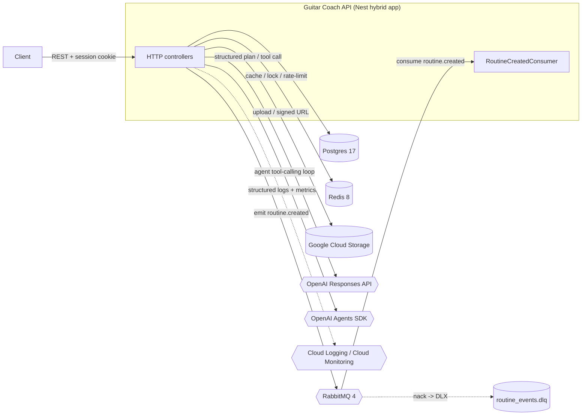
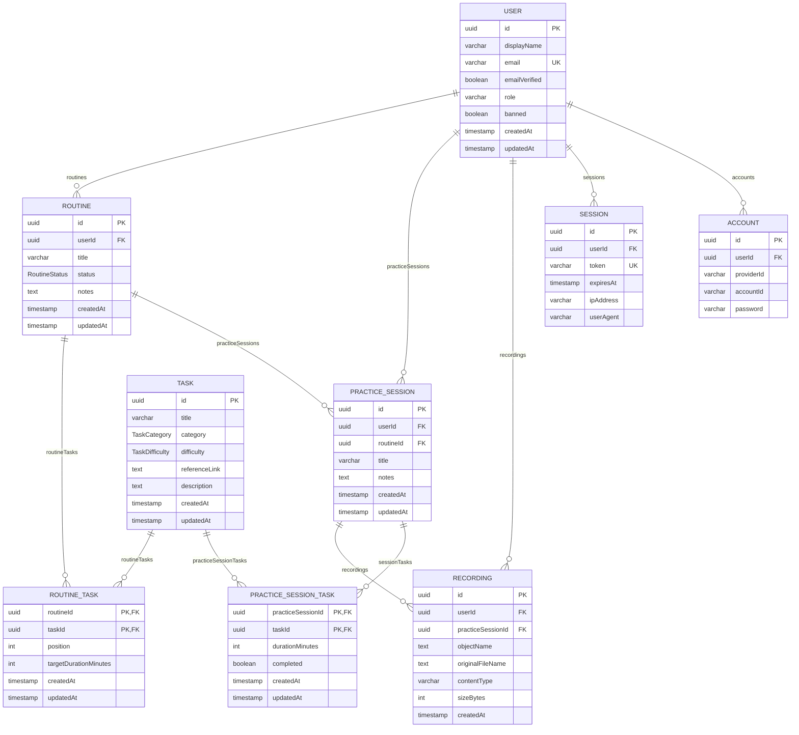

# Guitar Coach API

Backend API for Guitar Coach, built with [NestJS](https://nestjs.com/).

## Contents

- [Problem](#problem)
- [Overview](#overview)
- [Documentation](#documentation)
- [Architecture](#architecture)
- [User flow](#user-flow)
- [Data model](#data-model)
- [Local setup](#local-setup)
- [API examples](#api-examples)
- [API contract](#api-contract)
- [Authentication](#authentication)
- [Routines](#routines)
- [Practice recordings](#practice-recordings)
- [AI workflow](#ai-workflow)
- [AI Practice Planner](#ai-practice-planner)
- [AI Routine Coach](#ai-routine-coach)
- [Weekly routine cleanup job](#weekly-routine-cleanup-job)
- [Continuous deployment](#continuous-deployment)
- [Performance testing](#performance-testing)
- [Tradeoffs](#tradeoffs)
- [Architecture decisions](#architecture-decisions)
- [Resources](#resources)

## Problem

Guitar practice is easy to do inconsistently and hard to track: without a set list of things to work on, practice time skews toward whatever's fun over what actually needs work, there's no record of what was *actually* covered versus what was only planned, and any recordings end up scattered across voice-memo apps with no link back to the session they came from. Guitar Coach gives practice a shape: a shared library of technique/theory/repertoire tasks that users assemble into their own ordered **routines**, log as **practice sessions** (recording which tasks were actually covered, not just planned), and attach audio **recordings** to for later review. On top of building a routine by hand, two different AI-assisted paths exist for the same job — see [AI workflow](#ai-workflow) — so the project also doubles as a reference implementation of two distinct LLM tool-calling integration patterns, not just a CRUD backend.

## Overview

Guitar Coach is a backend API for tracking guitar practice: users build practice **routines** from a shared library of **tasks** (technique/theory/repertoire exercises), log **practice sessions**, and attach audio **recordings** of those sessions for later review.

The project is a standard NestJS application (Express platform) organized by feature module:

- **`config`** — loads and validates environment variables at startup using [Zod](https://zod.dev/) (`src/config/env.validation.ts`), exposed globally via `AppConfigModule`.
- **`health`** — Kubernetes/Docker-style liveness and readiness probes via [`@nestjs/terminus`](https://docs.nestjs.com/recipes/terminus).
- **`auth`** — email/password authentication via [Better Auth](https://www.better-auth.com/), mounted through [`@thallesp/nestjs-better-auth`](https://github.com/ThallesP/nestjs-better-auth) (see [Authentication](#authentication)).
- **`users`** — CRUD user management backed by Postgres via Prisma (see [Architecture decisions](#architecture-decisions)).
- **`tasks`** — CRUD task-library management backed by Postgres via Prisma, with pagination and filtering by `category`/`difficulty`, Redis-cached reads (see [Data model](#data-model)).
- **`routines`** — user-owned, ordered lists of tasks with per-task target durations; supports reordering under a Redis distributed lock, and publishes a `routine.created` event to RabbitMQ (see [Routines](#routines)).
- **`practice-sessions`** — user practice logs with attached audio recordings uploaded to Google Cloud Storage (see [Practice recordings](#practice-recordings)).
- **`ai-practice-planner`** — generates a structured practice-routine plan from a natural-language prompt via the OpenAI Responses API, then persists it through the existing `routines`/`tasks` services once the user explicitly confirms (see [AI Practice Planner](#ai-practice-planner)).
- **`ai-routine-coach`** — a single tool-calling `RoutineCoachAgent` (built on the [`@openai/agents`](https://github.com/openai/openai-agents-js) SDK) that inspects a user's recent practice sessions/routines/tasks, decides for itself which of those to look at, and creates a routine directly — no confirmation step. Gated by a native SDK input guardrail (see [AI Routine Coach](#ai-routine-coach)).
- **`gcp-storage`** — thin wrapper around [`@google-cloud/storage`](https://github.com/googleapis/nodejs-storage) used by `practice-sessions` to upload/delete objects and mint signed download URLs (see [Architecture](#architecture)).
- **`prisma`** — `PrismaService`/`PrismaModule` wiring Prisma ORM to Postgres (see [Architecture decisions](#architecture-decisions)).
- **`observability`** — structured JSON logging with per-request correlation IDs, a global error-normalizing exception filter, security-event logging, and the OTel metrics registry exported to GCP Cloud Monitoring (see [Architecture](#architecture) and `docs/monitoring/README.md`).

Cross-cutting infra (not feature modules, but wired globally in `AppModule`): a Redis-backed HTTP response cache, a Redis distributed lock, Redis-backed Better Auth rate-limit storage, a self-consumed RabbitMQ queue for domain events (with a dead-letter queue), and the `observability` module above (see [Architecture](#architecture)).

**Tech stack**: NestJS 11 (Express), TypeScript, Prisma 7 with the `@prisma/adapter-pg` driver adapter, Postgres 17, Better Auth 1.6, Redis 8, RabbitMQ 4, Google Cloud Storage, the OpenAI Node SDK (Responses API) and the `@openai/agents` Agents SDK, Zod (config validation), class-validator/class-transformer (request DTOs), Jest (unit + e2e).

API docs are served by Swagger UI at `/docs` once the app is running, and the same OpenAPI document is generated into a committed `openapi.json` at the repo root that CI keeps in lockstep with the code — that file is the contract a frontend generates its client from (see [API contract](#api-contract)). Both cover the Nest-controller routes below; Better Auth's own `/auth/*` endpoints aren't introspectable by Swagger — see [Authentication](#authentication).

## Documentation

This file covers architecture, data model, and local setup. Full endpoint walkthroughs, provisioning scripts, and design rationale live in `docs/`, one page per concern:

- [Request flows](docs/flows.md) — step-by-step trace of a request through auth, a core write, a cached read, and the async domain event
- [Authentication](docs/authentication.md) — sign-up/sign-in curls, roles, bootstrapping the first admin
- [Routines](docs/routines.md) — create/attach/reorder/delete endpoint walkthrough
- [Practice recordings](docs/practice-recordings.md) — practice sessions and audio recording upload/download
- [AI Practice Planner](docs/ai-practice-planner.md) — confirmation-gated AI routine planning
- [AI Routine Coach](docs/ai-routine-coach.md) — no-confirmation AI routine agent and its tools/guardrail
- [Weekly routine cleanup job](docs/weekly-routine-cleanup.md) — standalone Cloud Run Job setup and selection rules
- [Continuous deployment](docs/deployment.md) — CI/CD pipeline, one-time GCP setup, rollback
- [API contract](docs/api-contract.md) — the committed `openapi.json`, response-DTO conventions, and how a frontend stays in sync
- [Performance testing](docs/performance-testing.md) — k6 smoke/load tests for the practice-sessions create/list/get workflows
- [Architecture decisions](docs/architecture-decisions.md) — rationale behind non-obvious design choices
- [Monitoring & alerting](docs/monitoring/README.md) — OTel metrics, alert policies, log-based metrics

## Architecture

The API runs as a single **hybrid** Nest application: it serves HTTP over Express and, in the same process, runs a RabbitMQ microservice consumer — there's no separate worker deployable.



- **Postgres** is the system of record for everything (via Prisma). Every other piece of infra below is a supporting concern the app can degrade gracefully without.
- **Redis** backs three independent concerns, each with its own key namespace: an HTTP response cache for `GET /tasks*` (`TasksService`, via `@nestjs/cache-manager` + Keyv), a distributed lock guarding routine task-reordering (`RedisLockService`, `SET NX PX` + Lua compare-and-delete release), and rate-limit counters for Better Auth's `/sign-in/email`/`/sign-up/email` (`RedisRateLimitStorage`, wired as Better Auth's `customStorage` rather than `secondaryStorage` so session/verification data never lands in Redis). All three **fail open** — a Redis outage degrades to "no cache"/"no rate limit" rather than an outage, except the distributed lock, which fails closed (`503`) since reordering without it could corrupt task ordering.
- **RabbitMQ** carries a single domain event today: `RoutineCreatedProducer` publishes `routine.created` (fire-and-forget — a broker outage must never fail routine creation) after `POST /routines`, consumed in-process by `RoutineCreatedConsumer`, currently just a logging placeholder for future side effects (notifications, analytics, etc.). The envelope carries a `correlationId` propagated from the originating HTTP request; the queue is declared with a dead-letter exchange/queue (`routine_events.dlx`/`routine_events.dlq`, asserted at startup by `RoutineEventsDeadLetterTopologyInitializer`), and the consumer acks/nacks manually — a processing failure is nacked without requeue, routing it to the DLQ instead of being silently dropped or retried forever.
- **Google Cloud Storage** stores practice recording bytes privately; only metadata (object name, content type, size) lives in Postgres. `GcpStorageService.uploadObject` writes incoming buffers to a short-lived temp file and uses `bucket.upload()` rather than `file.save(buffer)` — the latter reliably triggered a `"Cannot call write after a stream was destroyed"` race in the client library's internal write pipeline when the whole buffer was pushed before the async upload-request setup had settled; `bucket.upload()` feeds the same pipeline via a paced `fs.createReadStream`, avoiding the race.
- **OpenAI Responses API** turns a natural-language prompt into a structured practice plan (Structured Outputs), optionally using OpenAI's built-in `web_search` tool when the model decides external information would help — never required. The `create_routine` custom tool that actually persists the routine is only ever included in the *second*, post-confirmation request to OpenAI; the model has no way to call it before the user confirms, because the tool definition simply isn't there yet. See [AI Practice Planner](#ai-practice-planner).
- **OpenAI Agents SDK (`@openai/agents`)** runs a single `RoutineCoachAgent` through the SDK's built-in tool-calling loop: it decides for itself which of five typed tools to call (four read tools plus `create_routine`) and in what order — that sequence is never hardcoded. The authenticated user is threaded through as SDK-native `RunContext`, never as a model-supplied argument; a heuristic (non-LLM) native input guardrail rejects off-topic or credential/SQL-probing requests before the model is even called. See [AI Routine Coach](#ai-routine-coach).
- **Observability** (`src/observability/`): every request gets a correlation ID (`x-request-id`, accepted from the client if well-formed, otherwise generated; returned in the response header), carried via `AsyncLocalStorage` and automatically attached to every structured JSON log line for that request — including ones from a Prisma query, a Redis operation, or a RabbitMQ publish triggered along the way. `StructuredLoggerService` replaces Nest's default console logger app-wide (`app.useLogger(...)` in `main.ts`) with zero changes to any existing `new Logger(ClassName.name)` call site, redacting known-sensitive fields (passwords, tokens, credentialed URLs) before every log line is emitted. A global `HttpExceptionFilter` normalizes every error response to `{statusCode, code, message, requestId}`, never leaking stack traces/Prisma internals/credentials, and automatically emits a security event for 401/403 responses. `SecurityEventLogger` gives auth failures, rate-limit denials, and AI guardrail trips one consistent, filterable log schema (`meta.eventCategory: "security"`) — this doubles as the audit trail for privileged actions (role changes, bans, account deletion) rather than a separate database table. OTel metrics (`src/observability/metrics/meters.ts`) cover HTTP/Postgres/Redis/RabbitMQ/job/AI signals, exported to GCP Cloud Monitoring via its native OTLP endpoint when `METRICS_EXPORT_ENABLED=true` (see `docs/monitoring/README.md` for the alerting runbook).

A fourth, fully separate process — the weekly routine cleanup job — runs outside this hybrid app entirely, on its own schedule; see [Weekly routine cleanup job](#weekly-routine-cleanup-job).

For a request-by-request walkthrough of these mechanisms — authentication, a core write, a cached read, and the async domain event — see [Request flows](docs/flows.md).

## User flow

1. **Sign up / sign in** — email + password via Better Auth, session cookie issued (see [Authentication](#authentication)).
2. **Browse the task library** — `GET /tasks`, optionally filtered by `category`/`difficulty` (see [Data model](#data-model)).
3. **Build a routine** — create a routine and attach tasks to it in order, with optional per-task target durations; reorder as needed (see [Routines](#routines)). Or describe what you want in natural language: the **AI Practice Planner** drafts a plan you must explicitly confirm before anything is saved (see [AI Practice Planner](#ai-practice-planner)), while the **AI Routine Coach** inspects your recent practice history itself and creates the routine directly, no confirmation step (see [AI Routine Coach](#ai-routine-coach)).
4. **Log a practice session** — create a practice session, optionally against a routine you followed and with the specific tasks you actually practiced (see [Practice recordings](#practice-recordings)).
5. **Upload a recording** — attach an audio recording of that session to Google Cloud Storage.
6. **Review later** — list a session's recordings and fetch a time-limited signed download URL for playback.

## Data model

Defined in `prisma/schema.prisma`; regenerate the diagram below by hand if the schema changes.



`category`, `difficulty`, and `status` are Postgres enums, not free-form strings:

- `TaskCategory`: `technique` | `theory` | `repertoire`
- `TaskDifficulty`: `easy` | `medium` | `hard`
- `RoutineStatus`: `active` | `archived` (default `active`)

`RoutineTask` is a join table between `Routine` and `Task` with a composite primary key (`routineId`, `taskId`) and a unique `(routineId, position)` constraint enforcing one task per position within a routine.

`PracticeSessionTask` is the equivalent join table between `PracticeSession` and `Task` — added so the app (and the [AI Routine Coach](#ai-routine-coach)) can tell what was *actually* practiced (with a per-task duration and a `completed` flag) rather than only what a routine *planned*. `PracticeSession.routineId` is an optional FK linking a session back to the routine it followed, if any — both this and `PracticeSessionTask` are populated only when the client supplies them on `POST /practice-sessions`; older sessions simply have no rows here.

`Recording` carries **two** foreign keys back to different ancestors — `userId` (direct owner) and `practiceSessionId` (parent session) — a denormalized owner reference that keeps ownership checks a single-column lookup instead of a join through `PracticeSession`.

Domain foreign keys (`Routine`, `RoutineTask`, `PracticeSession`, `PracticeSessionTask`, `Recording` → their required parent) default to Postgres's `ON DELETE RESTRICT`: a user can't be deleted while they still own routines, sessions, or recordings, and a session/task can't be deleted while a `PracticeSessionTask` row still references it. The one exception is `PracticeSession.routineId`, which is optional and `ON DELETE SET NULL` — deleting a routine a session was logged against un-links the session rather than blocking the delete or cascading it away. Better Auth's own tables behave differently — `Session` and `Account` cascade-delete when their `User` is deleted. `Session`, `Account`, and `Verification` are Better Auth's own tables (session tokens, linked credentials/OAuth accounts, and email-verification/reset tokens respectively); `Verification` has no FK to `User`, it's looked up by `identifier` instead.

## Local setup

### Prerequisites

- Node.js 24.x and npm
- Docker (for Postgres/Redis/RabbitMQ, and optionally for running the API itself)

### Option A — Docker Compose (recommended)

Runs the API, Postgres, Redis, and RabbitMQ together, with hot reload via bind mounts.

```bash
cp .env.example .env   # fill in POSTGRES_PASSWORD at minimum
docker compose -f compose.yaml -f compose.dev.yaml up
```

The API is available at `http://localhost:3000` (or `$PORT`), reloading on changes under `src/` and `test/`. Postgres is published on `$POSTGRES_PORT` (default `5432`).

**After changing `prisma/schema.prisma`**, rebuild the `api` image before testing against it:

```bash
docker compose -f compose.yaml -f compose.dev.yaml build api
docker compose -f compose.yaml -f compose.dev.yaml up -d api
```

The container's startup command only runs `prisma migrate deploy` (applies migration SQL) — it never runs `prisma generate`, so a running container's Prisma Client is stuck with whatever shape the schema had at image build time. `src`/`test` file sync doesn't cover this either. Symptoms if you skip this: `PrismaClientValidationError: Unknown argument '<field>'` in `docker compose logs api`, or a DB value you just changed (e.g. a user's `role`) not seeming to take effect.

For a production-shaped image instead:

```bash
docker compose -f compose.yaml -f compose.prod.yaml up --build
```

### Option B — Node directly

```bash
npm install
cp .env.example .env   # PORT/API_PREFIX/API_VERSION have defaults; NODE_ENV and DATABASE_URL are required
npx prisma generate     # generates the Prisma Client into src/generated/prisma
npm run start:dev
```

Note: `PrismaService` connects lazily, so the app boots without a reachable Postgres — but the `users` module queries the database on every request, so you'll need one running (and migrated) before calling any `/users` endpoint. Start one with `docker compose -f compose.yaml -f compose.dev.yaml up postgres`, then apply migrations with `npx prisma migrate deploy` (or point `DATABASE_URL` at any already-migrated Postgres 17-compatible instance).

### Environment variables

Validated in `src/config/env.validation.ts`; the app fails fast on startup if required variables are missing or malformed.

| Variable | Required | Default | Notes |
|---|---|---|---|
| `NODE_ENV` | yes | — | `development` \| `test` \| `production` |
| `PORT` | no | `3000` | |
| `API_PREFIX` | no | `api` | Global route prefix |
| `API_VERSION` | no | `v1` | |
| `POSTGRES_USER` / `POSTGRES_PASSWORD` / `POSTGRES_DB` / `POSTGRES_PORT` | Compose only | — | Configure the `postgres` container in `compose.yaml` |
| `DATABASE_URL` | yes | — | Postgres connection string read by Prisma (CLI and `PrismaService`). `compose.yaml` overrides it to point at the `postgres` service; `.env.example` has a `localhost` default for running the API outside Docker |
| `BETTER_AUTH_SECRET` | yes | — | Encryption/signing secret for Better Auth, min 32 characters. Generate with `openssl rand -base64 32`; never reuse the placeholder in `.env.example` |
| `BETTER_AUTH_URL` | yes | — | Base URL the API is served from (e.g. `http://localhost:3000`). Better Auth appends its own `/auth` base path |
| `CORS_ORIGINS` | yes | — | Comma-separated browser origins allowed to send the session cookie (e.g. `http://localhost:8081`). Required, not defaulted — a credentialed request can't be paired with a wildcard origin, so every web client has to be named. Parsed into a list that drives **both** `enableCors()` and Better Auth's `trustedOrigins`; see [Authentication](docs/authentication.md#browser-clients--cors). Native clients send no `Origin` header and are unaffected |
| `REDIS_URL` | yes | — | Redis connection string, shared by the HTTP cache, the routine-reorder distributed lock, and Better Auth rate limiting. `compose.yaml` overrides it to point at the `redis` service |
| `CACHE_TTL_MS` | no | `300000` | TTL for cached `GET /tasks`/`GET /tasks/:id` responses, 60000–600000 |
| `RABBITMQ_USER` / `RABBITMQ_PASSWORD` | Compose only | — | Configure the `rabbitmq` container in `compose.yaml`; the default `guest`/`guest` account only authenticates from localhost inside the container, so a real user/password is required |
| `RABBITMQ_URL` | yes | — | AMQP connection string for the `routine.created` event producer/consumer. `compose.yaml` overrides it to point at the `rabbitmq` service |
| `GCP_PROJECT_ID` / `GCS_RECORDINGS_BUCKET` | yes | — | GCP project and private bucket practice recordings are uploaded to |
| `GOOGLE_APPLICATION_CREDENTIALS` | local dev only | — | Path to a local service-account key file, read directly by `@google-cloud/storage` via Application Default Credentials (not through `ConfigService`). Must be fully-qualified — `~/...` is **not** expanded. Unset in production; Cloud Run's attached service account is used instead |
| `GCP_CREDENTIALS_HOST_PATH` | Docker Compose only | — | Same absolute host path as above; `compose.dev.yaml` bind-mounts it read-only into the container and points `GOOGLE_APPLICATION_CREDENTIALS` at the in-container path for you |
| `RECORDING_UPLOAD_MAX_SIZE_BYTES` | no | `52428800` (50MB) | Max accepted size for a single practice recording upload |
| `RECORDING_DOWNLOAD_URL_EXPIRY_SECONDS` | no | `900` | How long a `GET .../download-url` signed URL stays valid |
| `OPENAI_API_KEY` | yes | — | OpenAI API key used server-side only by `OpenAiResponsesService`; never exposed to clients |
| `OPENAI_MODEL` | yes | — | Model used for both the Responses API (structured outputs, `web_search`, `create_routine`) and the `RoutineCoachAgent`'s Agents SDK run; not hardcoded in code |
| `OPENAI_REQUEST_TIMEOUT_MS` | no | `30000` | Per-request timeout for calls to the OpenAI Responses API |
| `HEALTH_MEMORY_HEAP_THRESHOLD_BYTES` / `HEALTH_MEMORY_RSS_THRESHOLD_BYTES` | no | `314572800` (300MB each) | `GET /health/ready`'s Terminus `memory_heap`/`memory_rss` thresholds. `compose.dev.yaml` overrides RSS to 1GiB — `nest start --watch`'s dev-mode compiler runs well above 300MB for a couple minutes after boot, which otherwise fails the Docker `HEALTHCHECK` |
| `LOG_LEVEL` | no | `log` | Minimum level `StructuredLoggerService` emits: `verbose`\|`debug`\|`log`\|`warn`\|`error`\|`fatal` |
| `METRICS_EXPORT_ENABLED` | no | `false` | Whether OTel metrics export to GCP Cloud Monitoring (see `docs/monitoring/README.md`). Leave `false` outside production — the runtime service account needs `roles/monitoring.metricWriter` first, and export fails open (logs an error, never crashes the app) if misconfigured |

See `.env.example` for the full annotated list.

The [weekly routine cleanup job](#weekly-routine-cleanup-job) is a separate standalone process validated by its own, smaller schema (`src/weekly-routine-cleanup/env.validation.ts`): it reuses `DATABASE_URL` above and adds `ROUTINE_CLEANUP_TIME_ZONE` (default `UTC`) and `CLEANUP_WEEK_START` (manual override only) — it does not require any of the other variables in this table.

Redis and RabbitMQ are **required** by `compose.yaml` (`RABBITMQ_USER`/`RABBITMQ_PASSWORD` fail the Compose config outright if unset) — Option A always needs them reachable. Running via Option B (Node directly), the app itself tolerates them being unreachable at boot: the cache, distributed lock, and rate-limit storage all fail open/closed gracefully (see [Architecture](#architecture)) rather than crashing startup, though routine reordering will return `503` without a working Redis, and `routine.created` events silently won't publish without a working RabbitMQ.

### Common commands

```bash
npm run start:dev      # watch mode
npm run build           # compile to dist/
npm run start:prod      # run compiled output

npm run lint             # eslint --fix
npm run test             # unit tests (*.spec.ts, alongside source in src/)
npm run test:e2e         # e2e tests (test/*.e2e-spec.ts)
npm run test:cov         # coverage

npx prisma generate      # regenerate Prisma Client into src/generated/prisma after a schema change
npx prisma migrate dev   # create/apply a migration against DATABASE_URL
npx prisma studio        # browse the database

npm run weekly-routine-cleanup         # run the weekly routine cleanup job locally via tsx (see below)
npm run start:weekly-routine-cleanup   # run the compiled dist/ build (requires `npm run build` first) — mirrors the deployed Cloud Run Job's entrypoint
```

A Husky `pre-commit` hook checks `package-lock.json` stays in sync whenever `package.json` is staged.

## API examples

A quick, single-journey tour of the API using a cookie jar for the session: sign up, build a routine by hand, log a session against it, then let the AI Routine Coach build a second one on its own. Assumes the app is running at `http://localhost:3000` (see [Local setup](#local-setup)). Full per-endpoint walkthroughs — recordings, reordering, roles/admin, the AI Practice Planner's confirm/decline step, and more — are indexed under [Documentation](#documentation).

```bash
# Sign up (creates the User row + a session cookie)
curl -i -c cookies.txt -X POST http://localhost:3000/auth/sign-up/email \
  -H 'Content-Type: application/json' \
  -d '{"email":"jordan@example.com","password":"correct-horse-battery","name":"Jordan"}'

# Browse the task library
curl -s -b cookies.txt http://localhost:3000/api/v1/tasks

# Create a routine
curl -i -b cookies.txt -X POST http://localhost:3000/api/v1/routines \
  -H 'Content-Type: application/json' \
  -d '{"title":"Daily warm-up","notes":"15 minutes before practice"}'

# Attach a task to it (using a taskId from the "Browse the task library" response above)
curl -i -b cookies.txt -X POST http://localhost:3000/api/v1/routines/<routine-uuid>/tasks \
  -H 'Content-Type: application/json' \
  -d '{"taskId":"<task-uuid>","targetDurationMinutes":10}'

# Log a practice session against that routine
curl -i -b cookies.txt -X POST http://localhost:3000/api/v1/practice-sessions \
  -H 'Content-Type: application/json' \
  -d '{"title":"Morning session","routineId":"<routine-uuid>"}'

# Or skip the manual steps above entirely and let the AI Routine Coach build + persist a routine for you
curl -i -b cookies.txt -X POST http://localhost:3000/api/v1/ai/routine-coach \
  -H 'Content-Type: application/json' \
  -d '{"message":"Create a 30-minute warm-up routine for today."}'
```

## API contract

The OpenAPI document is a **committed artifact**: `openapi.json` at the repo root is generated from the controllers and their `*ResponseDto` classes, checked into git, and verified by CI. `npm run openapi:check` regenerates it and fails on any diff, so a route or DTO change can't be merged without the regenerated file alongside it — which is exactly how backend and frontend stay in sync: the frontend generates its types/client from `openapi.json` rather than hand-mirroring these DTOs, and every contract change arrives as a reviewable diff on one file.

```bash
npm run openapi:generate   # write openapi.json from the current code
npm run openapi:check      # regenerate + `git diff --exit-code openapi.json` (what CI runs)
```

Generated paths include the `${API_PREFIX}/${API_VERSION}` prefix the app actually serves (the health probes excepted, as at runtime), so a client only supplies an origin as its base URL. Remaining caveats worth knowing up front: `servers` is empty, auth is a session cookie with no `securitySchemes` entry to generate from, Better Auth's `/auth/*` routes are absent entirely (raw Express middleware, not introspectable), and only success responses are documented.

Response-DTO conventions, the `oneOf` pattern for the AI planner's union response, and the full frontend workflow: [`docs/api-contract.md`](docs/api-contract.md).

## Authentication

Auth is handled by [Better Auth](https://www.better-auth.com/) (email/password only for now), mounted at the bare `/auth` path — **not** under the `${API_PREFIX}/${API_VERSION}` prefix used by every other route, and not documented in the `/docs` Swagger UI (Better Auth's endpoints are raw Express middleware, not Nest controllers, so Swagger can't introspect them). A global `AuthGuard` protects every other route by default — requests without a valid session cookie get `401 Unauthorized`; individual routes opt out with the `@AllowAnonymous()`/`@OptionalAuth()` decorators. Two roles exist (`user`, `admin`), enforced via `@Roles(['admin'])` on admin-only routes; the very first admin has to be promoted directly in the database since Better Auth's own admin endpoints require an existing admin session.

Sign-up/sign-in/session curl examples, `role` semantics, and bootstrapping the first admin: [`docs/authentication.md`](docs/authentication.md).

## Routines

A routine is a user-owned, ordered list of tasks pulled from the shared [task library](#data-model), each with an optional target duration; all routes are scoped to the requesting user, so acting on another user's routine returns `404 Not Found` (not `403`). Reordering acquires a short-lived Redis distributed lock per routine (see [Architecture](#architecture)): a concurrent reorder fails fast with `409 Conflict`, and `503 Service Unavailable` if the lock can't be acquired at all. Creating a routine also publishes a `routine.created` event to RabbitMQ, fire-and-forget.

Full create/attach/reorder/delete curl walkthrough: [`docs/routines.md`](docs/routines.md).

## Practice recordings

Authenticated users can upload audio recordings of their practice sessions. Files are stored privately in Google Cloud Storage; only metadata (file name, content type, size, object path) is kept in Postgres. Requires `GCP_PROJECT_ID` and `GCS_RECORDINGS_BUCKET` to be set (see [Environment variables](#environment-variables)). Allowed content types: `audio/mpeg`, `audio/wav`, `audio/x-wav`, `audio/mp4`, `audio/x-m4a`, `audio/ogg`, `audio/webm`; max upload size defaults to 50MB. Sessions and recordings are scoped to the requesting user, same `404`-not-`403` convention as routines.

Full endpoint curl walkthrough and local GCS credential setup: [`docs/practice-recordings.md`](docs/practice-recordings.md).

## AI workflow

Two different ways to turn a natural-language description into a persisted routine, built as two intentionally different AI integration patterns rather than one flexible one:

| | [AI Practice Planner](#ai-practice-planner) | [AI Routine Coach](#ai-routine-coach) |
|---|---|---|
| Endpoint | `POST /api/v1/ai/practice-planner` | `POST /api/v1/ai/routine-coach` |
| SDK | OpenAI Responses API (Structured Outputs) | `@openai/agents` (tool-calling agent loop) |
| Confirmation before writing | Required — a plan is returned first, nothing persists until confirmed | None — a single call either returns a persisted routine or doesn't |
| Context gathering | None — plans from the prompt alone, optionally using `web_search` | Agent decides for itself which of four read tools to call before writing |

Use the Planner when the user should see and approve a plan before anything is saved; use the Coach when the app should look at the user's own recent practice history and just build the routine.

## AI Practice Planner

Describe the routine you want in plain language and get back a structured plan via the [OpenAI Responses API](https://platform.openai.com/docs/api-reference/responses) — nothing is saved until you explicitly confirm it. A single endpoint, `POST /api/v1/ai/practice-planner`, handles both steps of the exchange (ask → confirm/decline). Requires `OPENAI_API_KEY`/`OPENAI_MODEL` to be set (see [Environment variables](#environment-variables)). The authenticated user ID always comes from the session cookie, never the request body; the plan is validated twice before anything is written (Structured Outputs schema, then application code).

Full request/confirm/decline curl walkthrough and validation notes: [`docs/ai-practice-planner.md`](docs/ai-practice-planner.md).

## AI Routine Coach

Describe what you want ("create me a 45-minute routine based on what I haven't practiced recently") and a single `RoutineCoachAgent` — built on the [`@openai/agents`](https://github.com/openai/openai-agents-js) SDK's built-in tool-calling run loop — decides for itself which of five typed tools it needs (four read tools plus `create_routine`), gathers whatever context it thinks is relevant, and creates the routine directly. Unlike the [AI Practice Planner](#ai-practice-planner), there's no confirmation step: a single `POST /api/v1/ai/routine-coach` call either returns a persisted routine or doesn't. Requires `OPENAI_API_KEY`/`OPENAI_MODEL` to be set (see [Environment variables](#environment-variables)). A native heuristic input guardrail runs before the model is called at all, and the LLM never touches Prisma or is trusted about whether a write succeeded — `create_routine`'s arguments are independently re-validated in application code.

Full tool table, guardrail behavior, and error-mapping notes: [`docs/ai-routine-coach.md`](docs/ai-routine-coach.md).

## Weekly routine cleanup job

A standalone, HTTP-less NestJS process (`src/weekly-routine-cleanup/`) that archives routines left `active` from before the current week, so every user starts the week with a clean routine list. It runs separately from the API — as a scheduled Google Cloud Run Job, not the in-process hybrid pattern used for the RabbitMQ consumer. A routine is archived only if `status = active AND createdAt < currentWeekStart` (Monday 00:00:00 in `ROUTINE_CLEANUP_TIME_ZONE`); the selection is idempotent, so rerunning the job any number of times is safe.

Selection/week-boundary rules and the full one-time GCP setup script: [`docs/weekly-routine-cleanup.md`](docs/weekly-routine-cleanup.md).

## Continuous deployment

`.github/workflows/google-cloudrun-docker.yml` builds the API image, pushes it to Artifact Registry, and deploys it to Cloud Run on every push to `main`. `.github/workflows/ci.yml` runs format/lint/test/build on every PR. Both authenticate to Google Cloud via **Direct Workload Identity Federation** — no service account key ever exists as a GitHub secret; a GitHub Actions OIDC token is exchanged directly for short-lived GCP credentials, scoped to a specific repo. A third, independent workflow (`.github/workflows/k6-performance.yml`) runs in parallel with these on every PR/merge — see [Performance testing](#performance-testing) below.

Full one-time GCP project setup script, gotchas hit getting it working, and how to roll back a bad deploy: [`docs/deployment.md`](docs/deployment.md).

## Performance testing

A k6-based smoke test and a small, env-var-configurable load test cover the `practice-sessions` module's create/list/get endpoints — the first performance-testing coverage in the repo, meant as a pattern to copy for other modules. Both scripts self-provision a dedicated test user in `setup()` (sign-in, falling back to sign-up) rather than depending on seeded dev data, tag requests per-workflow for separate latency/error-rate breakdown, and default to `localhost` only, requiring an explicit opt-in to target anything else. A lightweight version also runs in CI on every PR and merge to `main`, against the app's existing deployed (pre-production) Cloud Run environment.

Full setup, env vars, thresholds, and how to read the output: [`docs/performance-testing.md`](docs/performance-testing.md).

## Tradeoffs

A handful of the deliberate tradeoffs behind the design (full rationale for each, plus around a dozen more, in [Architecture decisions](#architecture-decisions) below):

- **Fail-open caching/rate-limiting, fail-closed locking.** A Redis outage degrades `GET /tasks*` to uncached and lets auth rate limits go unenforced rather than breaking requests — but the routine-reorder distributed lock fails closed (`503`), since proceeding without it risks corrupting task order.
- **A temp-file upload path instead of `file.save(buffer)` for GCS.** The simpler in-memory call reliably raced against the client library's internal stream setup; a paced `fs.createReadStream` avoids it, at the cost of a disk round-trip per upload.
- **Exactly one `@openai/agents` `Agent`, even for the input guardrail.** The SDK's documented pattern for LLM-based guardrails would mean a second agent; a synchronous keyword heuristic is used instead to keep a "one agent per integration" invariant, at the cost of a less nuanced guardrail.
- **Prisma error translation duplicated per service, not centralized.** Every service repeats its own `isPrismaErrorCode` helper rather than sharing one — a little duplication, in exchange for not coupling every service to a shared util that would need updating for each new Prisma error code any one of them needs to handle.
- **Security events are a log stream, not a database table.** Auth failures, rate-limit denials, and AI guardrail trips share one structured log schema instead of a dedicated audit table, leaning on Cloud Logging's retention rather than building out a subsystem this app's size doesn't yet justify.
- **The RabbitMQ consumer runs in-process, not as a separate worker deployable.** One Nest hybrid app serves HTTP and consumes `routine.created` in the same process — simpler to deploy at this scale, at the cost of HTTP traffic and consumer load sharing the same container.
- **AI-generated tasks always create a new `Task` row instead of fuzzy-matching an existing one.** Simpler and more predictable than similarity matching, at the cost of the shared task library accumulating near-duplicates over time.

## Architecture decisions

Dozens of non-obvious design choices (health-check split, fail-open vs. fail-closed infra, the AI feature seams, structured logging/security events, metrics export target, RabbitMQ dead-letter topology, and more) are recorded as one bullet each, with the rationale behind each one.

Full list: [`docs/architecture-decisions.md`](docs/architecture-decisions.md).

## Resources

- [NestJS Documentation](https://docs.nestjs.com)
- [Terminus health checks](https://docs.nestjs.com/recipes/terminus)
- [Zod](https://zod.dev/)
- [Better Auth](https://www.better-auth.com/docs)
- [Prisma](https://www.prisma.io/docs)
- [Redis](https://redis.io/docs/latest/)
- [RabbitMQ](https://www.rabbitmq.com/docs) / [amqplib](https://github.com/amqp-node/amqplib)
- [@google-cloud/storage](https://github.com/googleapis/nodejs-storage)
- [OpenAI Responses API](https://platform.openai.com/docs/api-reference/responses) / [OpenAI Node SDK](https://github.com/openai/openai-node)
- [OpenAI Agents SDK for JavaScript/TypeScript](https://openai.github.io/openai-agents-js/)
