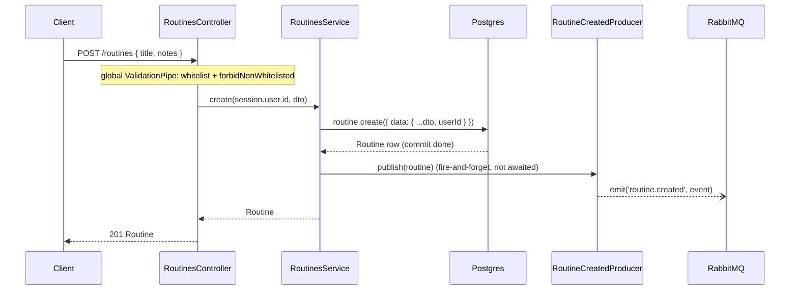
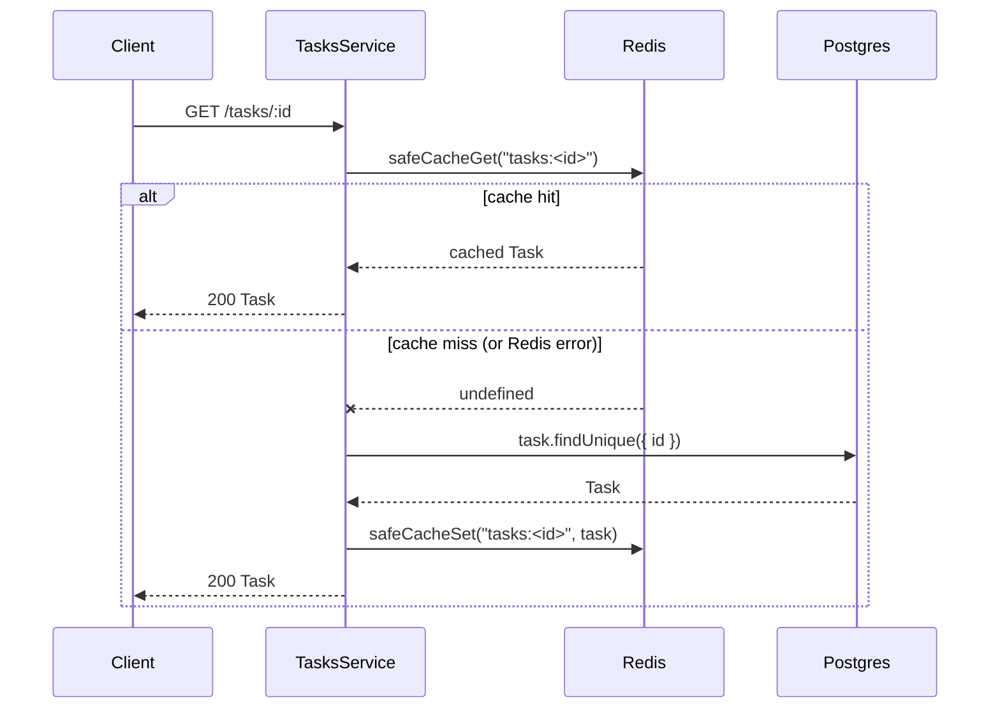
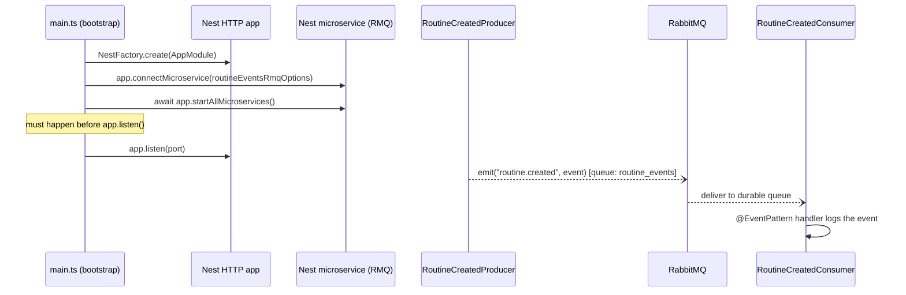

# Request flows

Four representative request/data flows through the API, traced step by step against the actual code. [`README.md`](../README.md) covers the "what" (endpoints, data model, setup); this covers the "how" for the four mechanisms that recur across every feature module — useful when extending one of these patterns (a new cached resource, a new async event, a new user-scoped write) rather than inventing a new one.

- [Authentication](#authentication)
- [Core write](#core-write)
- [Cached read](#cached-read)
- [Asynchronous domain event](#asynchronous-domain-event)

## Authentication

Auth is [Better Auth](https://www.better-auth.com/) (email/password), mounted as raw Express middleware at the bare `/auth` path — outside the `${API_PREFIX}/${API_VERSION}` prefix every Nest controller sits behind (`src/main.ts:26-32`). A global `AuthGuard` (registered as `APP_GUARD` by `AuthModule.forRootAsync` in `src/app.module.ts:55-61`, from `@thallesp/nestjs-better-auth`) protects every other route by default.

**Sign-in issues the cookie.** `POST /auth/sign-in/email` and `/auth/sign-up/email` are handled entirely by Better Auth's own middleware — there's no Nest controller in the path, which is also why these routes don't appear in the Swagger UI at `/docs` (see [Architecture decisions](../README.md#architecture-decisions) in the README).

**Every other request goes through `AuthGuard`.** `AuthGuard.canActivate` calls `auth.api.getSession({ headers })`, attaches the result to `request.session`/`request.user`, then applies decorator metadata in order: `@Public()`/`@AllowAnonymous()` skips the session check entirely (e.g. `src/health/health.controller.ts:27,34`, since liveness/readiness probes can't authenticate); `@OptionalAuth()` allows an anonymous request through but still populates the session if one exists; otherwise a missing session throws `401`; `@Roles([...])` then checks the authenticated user's role and throws `403` if it doesn't match (e.g. `@Roles(['admin'])` on `TasksController`'s mutating routes, `src/tasks/tasks.controller.ts:25,41,50`). Controllers that need the authenticated user inject it with `@Session() session: UserSession` (`src/routines/routines.controller.ts:34` — `session.user.id` is what scopes every routines query to its owner; see [Core write](#core-write)).

**Rate limiting is Redis-backed but deliberately isolated from sessions.** `src/auth/auth.ts:34-41` configures `rateLimit.customRules` for `/sign-in/email` (5/min) and `/sign-up/email` (3/min), backed by `RedisRateLimitStorage` (`src/auth/redis-rate-limit-storage.ts`) wired as `rateLimit.customStorage` — **not** `secondaryStorage`, which Better Auth also uses for session/verification-token caching and would put PII in Redis (comment at `auth.ts:29-33` and `redis-rate-limit-storage.ts:24-28`). `consume()` (`redis-rate-limit-storage.ts:79-103`) runs a Lua script (`CONSUME_SCRIPT`, lines 15-22) doing an atomic `INCR` + conditional `EXPIRE` + `TTL` read in one round trip, and **fails open** on any Redis error — catches, logs a warning, and returns `{ allowed: true }` (lines 96-102), because Better Auth awaits this call inline with no timeout of its own, so a Redis outage must never block sign-in.

**Why it's built this way:** this is the one auth-adjacent Redis use that fails open by design, same as the [cached read](#cached-read) flow below — a rate-limit check is a non-critical guard, not a correctness requirement, so degrading to "unlimited" beats degrading to "can't sign in."

## Core write

Representative example: `POST /routines` (`src/routines/routines.controller.ts:32-38` → `RoutinesService.create`, `src/routines/routines.service.ts:69-86`).

**Validation happens before the handler runs.** `CreateRoutineDto` uses `class-validator` decorators; the global `ValidationPipe({ whitelist: true, forbidNonWhitelisted: true, transform: true })` (`src/main.ts:36-42`) rejects any request body with unrecognized properties rather than silently dropping them.

**Ownership is enforced two different ways depending on the operation.** On `create`, ownership is established by writing `userId` directly into the row (`routines.service.ts:70-72`, `data: { ...dto, userId }` — there's nothing to check yet, the row doesn't exist). On every other operation, ownership is enforced by scoping the query itself to `{ id, userId }`: `findById` uses `findFirst({ where: { id, userId } })` and throws `NotFoundException` if nothing matches (`routines.service.ts:116-126`); `update`/`remove` use `updateMany`/`deleteMany` with the same `where` and check `count === 0` (lines 128-153). A routine that exists but belongs to someone else is indistinguishable from a routine that doesn't exist — both return `404`, never `403`, so existence isn't leaked to non-owners.

**Prisma errors are translated locally, not globally.** `routines.service.ts:46-53` defines a local `isPrismaErrorCode` type guard (`error instanceof Prisma.PrismaClientKnownRequestError && error.code === code`) — duplicated verbatim in `tasks.service.ts` and `users.service.ts` rather than shared, deliberately (see [CLAUDE.md](../CLAUDE.md) — no shared exception filter). The mapping used across `RoutinesService`:

| Prisma code | Meaning here | Thrown as |
|---|---|---|
| `P2025` (record not found) | task not attached to routine on `updateTask`/`removeTask` | `NotFoundException` (lines 230-234, 256-260) |
| `P2002` (unique violation) | task already assigned, or its position is taken | `ConflictException` (`addTask` lines 195-198, `updateTask` lines 235-238) |
| `P2003` (FK violation) | deleting a routine that still has tasks attached | `ConflictException` (`remove`, lines 154-159) |
| `P2003` (FK violation) | attaching a task id that doesn't exist | `NotFoundException` (`addTask`, lines 200-202) — same Prisma code, opposite direction, so the exception depends on which side of the relation is missing |

**The event publish happens after the commit, and is never awaited.** `create()` awaits `prisma.routine.create(...)` first — the write is durable — then calls `this.routineCreatedProducer.publish(routine)` synchronously (`routines.service.ts:78-83`). The surrounding `try/catch` only guards a *synchronous* throw from `publish` itself; `publish` (`routine-created.producer.ts:24-43`) is fire-and-forget internally too (see [Asynchronous domain event](#asynchronous-domain-event)), so a RabbitMQ outage can never fail a `POST /routines` request.

**Why it's built this way:** this is the pattern documented in `CLAUDE.md` as "async domain events are fire-and-forget" and "ownership checks, not just auth" — copy this shape (query scoped to `{ id, userId }`, `404` on a miss, publish after commit) for any new user-scoped write.

## Cached read

Representative example: `GET /tasks` and `GET /tasks/:id` (`src/tasks/tasks.service.ts` `findAll`/`findById`).

**Cache is checked before Postgres, on a per-key basis.** `findById` computes `taskCacheKey(id)` → `` `tasks:${id}` `` (`tasks.service.ts:158-160`) and calls `safeCacheGet` (line 103); a hit returns immediately without touching Postgres. `findAll` does the same with a versioned list key: `` `tasks:list:v${version}:${page}:${limit}:${category}:${difficulty}` `` (lines 162-171), so different filter/pagination combinations get distinct cache entries.

**List invalidation is a version bump, not a delete-by-pattern.** The generic `Cache` interface (`cache-manager`) has no way to enumerate or pattern-delete keys, so there's no way to directly invalidate every `tasks:list:*` entry after a write. Instead, `create`/`update`/`remove` all call `bumpListCacheVersion()` (lines 173-177), which increments a separate non-expiring counter key (`tasks:list:version`, `ttl: 0`) — every list-cache key embeds the *current* version at read time, so bumping it makes all previously-cached list keys unreachable going forward (they still exist in Redis but nothing will ever look them up again; they age out via the global `CACHE_TTL_MS`). `update`/`remove` additionally `safeCacheDel` the single-item key directly, since that one *is* addressable by id (lines 119-136, 138-156).

**Every cache operation fails open.** `safeCacheGet`/`safeCacheSet`/`safeCacheDel` (`tasks.service.ts:182-213`) each wrap the underlying `cache-manager` call in `try/catch`, log a warning, and return `undefined`/no-op rather than propagating — the comment at lines 179-181 states the rule directly: "Redis is an optimization here, not a dependency: on any cache failure we log and fall back to a miss/no-op so Postgres remains the source of truth." The Redis client backing the cache is also configured defensively at the connection level (`KeyvRedis` in `src/app.module.ts:43-50`): `disableOfflineQueue: true` plus a 2s `connectTimeout` so a dead Redis fails fast into `safeCacheGet`'s `catch` rather than hanging the request.

**Why it's built this way:** per `CLAUDE.md`'s "fail-open vs. fail-closed" convention — this is the fail-open default. The one deliberate exception in this codebase is `RedisLockService` guarding routine reorders, which fails *closed* (`503`) because proceeding without the lock risks corrupting task ordering; default to fail-open like this flow unless a new feature has that same correctness requirement.

## Asynchronous domain event

The one event this codebase publishes today: `routine.created`, emitted after `POST /routines` (see [Core write](#core-write)) and consumed in the same process.

**Queue name and routing pattern are deliberately two different strings.** `ROUTINE_EVENTS_QUEUE = 'routine_events'` is the actual AMQP queue; `ROUTINE_CREATED_PATTERN = 'routine.created'` (`routine-created.event.ts:3`) is the routing key/event-pattern used by both `client.emit(...)` and `@EventPattern(...)`. Both producer and consumer import the same `ROUTINE_EVENTS_QUEUE_OPTIONS` constant (`src/routines/events/rabbitmq.constants.ts:11-14`) rather than each declaring their own literal — the comment there explains why: RabbitMQ rejects a queue redeclare whose options don't match the first declaration, so the two sides drifting apart would break at runtime, not at compile time.

**The message envelope is versioned.** `RoutineCreatedEvent` (`routine-created.event.ts:5-16`) carries `eventId` (a fresh `randomUUID()` per publish), `eventType`, `eventVersion: 1`, `occurredAt`, and a `data` payload trimmed to just `{ routineId, userId, title, status }` — not the full `Routine` row.

**The producer is genuinely fire-and-forget.** `publish()` (`routine-created.producer.ts:24-43`) has a `void` return type, never `await`s anything, and calls `this.client.emit(...).subscribe({ error: ... })` — `emit()` returns a hot RxJS observable that dispatches immediately without needing a subscriber; the `.subscribe({ error })` exists purely so a publish failure is logged instead of surfacing as an unobserved RxJS error, not to block or retry.

**The consumer is a plain Nest controller, not a distinct service.** `RoutineCreatedConsumer` (`routine-created.consumer.ts`) is `@Controller()` with a single `@EventPattern(ROUTINE_CREATED_PATTERN)` handler that currently just logs the event — a placeholder for future side effects (notifications, analytics). It's registered in the same `controllers: [...]` array as `RoutinesController` in `routines.module.ts`.

**No separate worker process exists for this.** The hybrid bootstrap in `src/main.ts:21-24` — `app.connectMicroservice(routineEventsRmqOptions(...))` then `await app.startAllMicroservices()`, called *before* `app.listen(port)` — runs the RabbitMQ consumer inside the exact same Node process and `Application` instance as the HTTP server. This is Nest's documented hybrid-application pattern, not a coincidence of shared code: there is one deployable, one process, one set of env vars.

**Why it's built this way:** contrast this with `src/weekly-routine-cleanup/`, which is a genuinely separate process (`NestFactory.createApplicationContext()`, no HTTP/microservice listener, its own `main.ts`, deployed as an independent Cloud Run Job). The rule from `CLAUDE.md`: a new async **consumer** for an existing or new domain event follows this hybrid in-process pattern; a new **scheduled batch job** follows the standalone pattern instead. Don't conflate the two.
